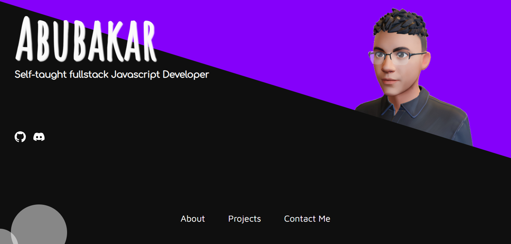

    
    <h1 align="center">Abubakar</h1>

<h1 align="center">❗ My Projects ❗</h1>

    
    
    
    

## About Me 🧑

-   I'm a self-taught programmer living in Malaysia.
-   I'm a full stack developer and I love using Javascript as it offers endless possibilities for myself.
-   I use vanilla HTML and CSS to design my frontend.

<h3 align="center">I am a freelancer programmer and a designer who is willing to work for you! Feel free to contact me through my personal portfolio! 😊<h3>
